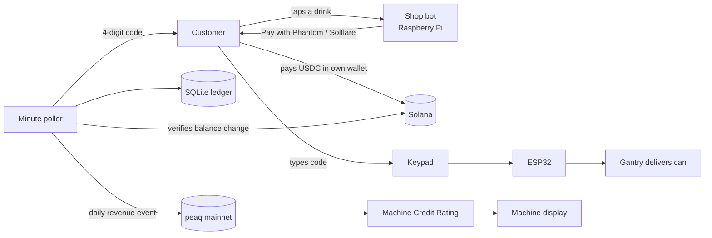

# SolVend × peaq

**A physical vending machine that earns its own credit rating.**

SolVend is a working vending machine. A customer opens its Telegram bot, taps a
drink, pays in USDC from their own Solana wallet, receives a 4-digit code, and
types it on the machine's keypad; a gantry delivers the can. A Raspberry Pi
inside the machine runs everything.

This project makes SolVend an economic participant on **peaq**. The machine
holds a peaq identity on mainnet and reports its sales as revenue events, so
its **Machine Credit Rating is built from real trade**, not simulated telemetry.

| | |
|---|---|
| **Machine DID** | `did:peaq:8600820691859294852796023821329786994502637838982221572620760063908348418155` |
| **Activation** | [`0xdeab1fed…ed50b77`](https://peaq.subscan.io/tx/0xdeab1fed124579378f9558e55861772729ec37ac4b99841cd65e53865ed50b77) on Subscan: Entry tier, 0.495 PEAQ bond, identity NFT |
| **Credit rating** | [Live from the MCR API](https://mcr.peaq.xyz/mcr/did:peaq:8600820691859294852796023821329786994502637838982221572620760063908348418155) (public, no key) |
| **First sale** | [1.00 USDC on Solana mainnet](https://solscan.io/tx/ZF3QEkkNcRV6tVU1c1pV3pTdr4CGmdj5td4x7xeTiS4XuNEYWendSKAo7FTry5tQygMw6FAc6Phwke9eUfoGNyi) |
| **Network** | peaq mainnet (chain 3338), `peaq-mainnet` Economics 2.0 deployment |
| **Demo video** | _(link)_ |
| **Evidence** | [`EVIDENCE.md`](EVIDENCE.md): every claim with a verifiable artifact |

---

## Why it matters

A machine with no financial history is equipment. A machine with verifiable
revenue is an **asset**: it can be rated, insured, financed and fractionally
owned. The Machine Credit Rating is only as meaningful as the revenue behind
it, so SolVend is built so that every reported dollar is provably real:

- **The payment is verified on-chain.** Settlement reads the merchant's USDC
  balance change from the transaction itself; a receipt, webhook or API
  response is never trusted.
- **Revenue is a physical act.** Only invoices that were paid *and* whose code
  was entered at the keypad count as revenue.
- **Reporting is automatic and deterministic.** A scheduled job builds revenue
  events from the ledger. No person and no language model sits between a sale
  and its report.

## How it works



### 1. Identity

A one-time activation on peaq mainnet gave the machine a permanent ID, a
`did:peaq:` identifier, an identity NFT held by the machine's own wallet, and a
one-year Entry-tier bond. The ID is derived from the machine type and a
credential subject containing a hash of **the Pi's hardware serial**
([`peaq/credential-subject.json`](peaq/credential-subject.json)). The machine's
wallet was generated on the Pi into an encrypted vault; its key has never left
the device.

### 2. Purchase

1. **Order.** Any message to the shop bot returns one button per catalogue item.
   A tap creates an invoice priced from the catalogue, with a random 32-byte
   Solana Pay reference ([`solvend/shop_bot.py`](solvend/shop_bot.py)).
2. **Pay.** The bot replies with **Pay with Phantom** and **Pay with Solflare**.
   These are the wallets' `https://` browse links: they open the checkout page
   ([`docs/pay/`](docs/pay/index.html)) inside the wallet, which builds a single
   USDC transfer with the invoice reference attached. The customer approves it
   in their own wallet.
3. **Verify.** Every minute the poller finds the payment by its reference, checks
   the merchant's on-chain balance change against the invoice, and issues a
   single-use 4-digit code to the customer's chat
   ([`solvend/solvend.py`](solvend/solvend.py)).
4. **Dispense.** The code is entered at the keypad. The ESP32 forwards it to the
   Pi, which burns it atomically and commands the gantry
   ([`solvend/solvend-serial.py`](solvend/solvend-serial.py)).

### 3. Revenue reporting

The same minute poller runs [`peaq/machine.py`](peaq/machine.py) `--sync`. It
groups dispensed sales by UTC day and, once a day reaches **$10** (the minimum
the credit rating counts), submits **one revenue event** for that day:

| Field | Value |
|---|---|
| `value` | Day's revenue in US cents (ISO 4217 minor units) |
| `currency` | `USD` |
| `timestamp` | Time of the day's last sale |
| `trust_level` | Self-reported (`0`) |
| `source_chain_id` | `0` (off-chain); Solana is not yet a peaq source chain |
| `raw_data` | Day, sale count, invoice IDs and **the Solana signature of every sale**, so each event can be checked against Solana |

Every reported invoice is recorded against its event, keyed by invoice ID, so a
retry, a restart or a manual run can never report a sale twice. A failed
submission writes nothing and is retried on the next run.

### 4. Credit rating and display

peaq aggregates the events into the machine's Machine Credit Rating, which
anyone can read from the public MCR API. The machine's screen
([`tools/machine_display.py`](tools/machine_display.py)) shows the payment
page between sales and, when idle, the machine's identity card: DID, credit
grade and score, cans sold, revenue, and revenue reported to peaq. `/machine`
adds the recent peaq events with explorer links.

---

## Security model

**The machine holds no key that can move customer funds.** Customers sign
their own payments; the machine only issues payment requests and reads the
chain. Its own peaq wallet signs identity and revenue events and holds only
PEAQ for gas.

| Attempt | Result | Why |
|---|---|---|
| Forge a button to buy for less | Invoice at the catalogue price, or none | Buttons carry only an item name; prices come from `ITEMS` |
| Edit the amount in a payment link | The payment never settles | Settlement checks the merchant's balance change against the invoice |
| Redirect a payment link to another wallet | Not possible | The merchant address and USDC mint are constants in the checkout page, not link parameters; the bot refuses to start if the published page differs from the machine's configuration |
| Reuse a code | Refused | Codes are burned atomically on first use and expire after 15 minutes |
| Guess a code | Locked out | Each wrong entry counts against every live invoice's attempt budget |
| Pay one invoice, claim another | Refused | A payment carrying one invoice's reference can never settle a different invoice |
| Report revenue that didn't happen | Not possible | Events are built only from dispensed ledger rows by the poller |

The ESP32 has no network stack and no credentials. The Pi can send it exactly
two commands: dispense a slot, or refuse.

---

## Hardware

| Part | Role |
|---|---|
| Raspberry Pi 4 (4 GB) | Shop bot, ledger, payment verification, peaq reporting, display |
| ESP32 | Keypad and motors; no network, no keys |
| NEMA 17 + A4988 | Gantry positioning |
| 2 × MG996R servos | Release and present the can |
| 16×2 I²C LCD, 4×3 keypad | Customer interface at the machine |
| TEC1-12706 + 12 V supply | Cooling |

Serial protocol, 115200 8N1: `KEYPAD:<4 digits>` and `EVENT:*` from the ESP32;
`DISPENSE:drink-N`, `DENY:<reason>` and `PING` to it.

## Repository layout

```
solvend/solvend.py          state machine, ledger, on-chain payment verification
solvend/shop_bot.py         Telegram ordering bot: buttons, invoices, wallet pay links
solvend/solvend-serial.py   ESP32 bridge: keypad codes in, dispense commands out
solvend/bin/solvend-poll.sh minute poller: settle, deliver codes, report revenue
docs/pay/                   checkout page opened inside the customer's wallet
peaq/machine.py             machine identity, revenue events, credit rating
peaq/*.json                 activation inputs and the activation preview
peaq/UPSTREAM-ISSUES.md     issues found in peaqOS during integration
tools/machine_display.py    the machine's screen
firmware/solvend_esp32/     ESP32 firmware
deploy/                     install script and systemd units
evidence/                   screenshots referenced by EVIDENCE.md
```

## Running it

**Tests** need no network, wallet or hardware:

```bash
git clone https://github.com/Yahmad2601/solvend-peaq && cd solvend-peaq
python3 solvend/test_solvend.py           # 55 tests: payments, codes, expiry, refunds
python3 solvend/test_shop_bot.py          # 25 tests: ordering, pricing, pay links
python3 peaq/test_machine.py              # 24 tests: cents, threshold, idempotency
pip install qrcode && python3 tools/test_machine_display.py   # 21 tests
```

**On the machine** (Raspberry Pi OS / Debian, Python ≥ 3.10):

```bash
bash deploy/pi-deploy.sh                  # installs to /opt/solvend, ledger in /var/lib/solvend
sudo cp deploy/solvend-*.service /etc/systemd/system/
sudo systemctl enable --now solvend-shop solvend-serial
```

**peaq identity** (once per machine):

```bash
python3 -m venv .peaq && . .peaq/bin/activate
pip install 'peaq-os-cli[ows]'            # prebuilt aarch64 wheels
peaqos wallet create solvend --words 24   # encrypted machine wallet, on the device
python3 peaq/machine.py --spike            # signing client + chain check
python3 peaq/machine.py --activate-preview # bond quote and the resulting machine ID
python3 peaq/machine.py --activate         # activation; shows terms before signing
python3 peaq/machine.py --status           # DID, credit rating, reported and pending revenue
```

Activation needs PEAQ on peaq for the bond and gas (about 0.6 PEAQ).

### Configuration

Settings live in `/etc/solvend/env` (mode 640, `root:pi`).

| Variable | Purpose |
|---|---|
| `SOLVEND_RPC_URL`, `SOLVEND_USDC_MINT`, `SOLVEND_RECIPIENT` | Solana mainnet RPC, USDC mint, merchant wallet |
| `SOLVEND_SHOP_BOT_TOKEN`, `SOLVEND_PAY_PAGE_URL` | Shop bot token and published checkout page |
| `PEAQOS_RPC_URL`, `TOKENOMICS_DEPLOYMENT_ID`, `PEAQOS_MCR_API_URL` | peaq mainnet RPC, `peaq-mainnet`, `https://mcr.peaq.xyz` |
| `IDENTITY_REGISTRY_ADDRESS` … `BATCH_PRECOMPILE_ADDRESS` | peaqOS contract addresses required by the SDK client |
| `PEAQOS_OWS_WALLET`, `OWS_PASSPHRASE` | Machine wallet and its vault passphrase |
| `PEAQ_MACHINE_ID` | The machine's base-10 peaq ID |
| `PEAQ_REPORT_FROM` | Unix time from which sales count as revenue |

## Issues found in peaqOS

Six issues found while integrating, from a Cloudflare rule that blocks the
public MCR API for Python clients to documentation gaps around Tokenomics 2.0,
are written up with reproductions in
[`peaq/UPSTREAM-ISSUES.md`](peaq/UPSTREAM-ISSUES.md).

## License

MIT.
